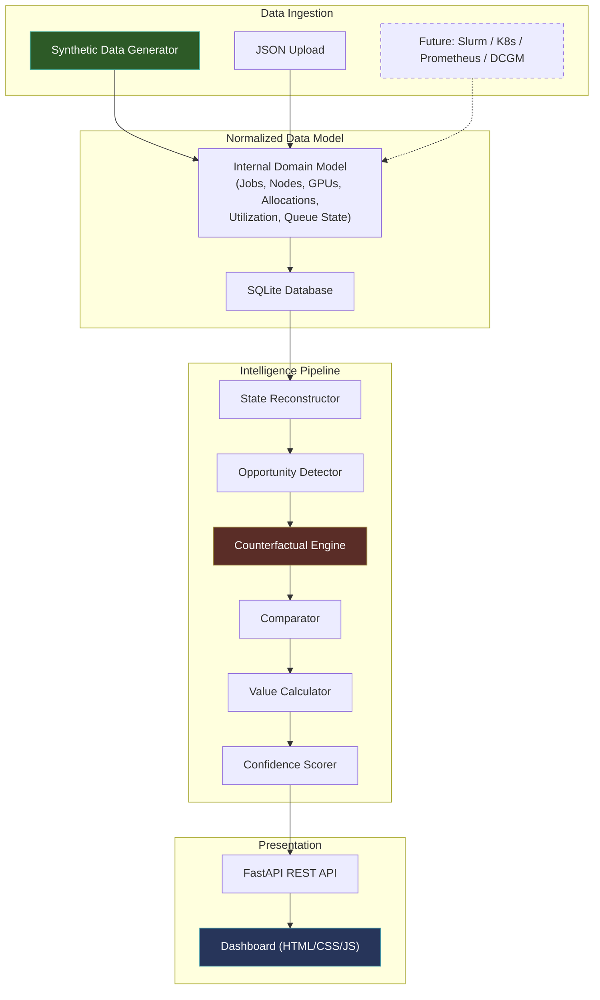

# Natilah V1 — AI Infrastructure Intelligence Layer

> **Natilah deploys AI intelligence into existing AI infrastructure to identify better infrastructure decisions and quantify the compute, energy, and cost value they could unlock.**

V1 focuses exclusively on **compute and GPU economics**. The system is **read-only by design** — it observes, analyzes, simulates alternatives, and calculates value. It never modifies infrastructure.

---

## User Review Required

> [!IMPORTANT]
> **Technology stack choice**: This plan proposes **Python 3.12+ / FastAPI** for the backend and **vanilla HTML/CSS/JS** for the dashboard. Python is the natural choice for the simulation/optimization layer and GPU ecosystem tooling. Please confirm or suggest alternatives.

> [!IMPORTANT]
> **Data storage**: The plan uses **SQLite** for V1 (zero-dependency, file-based, sufficient for historical analysis). PostgreSQL can be swapped in later. Please confirm this is acceptable for the MVP.

> [!IMPORTANT]
> **Simulated data scope**: The MVP will ship with a **synthetic data generator** that creates realistic GPU cluster scenarios (64-node cluster, mixed A100/H100 GPUs, ~500 jobs over 24 hours). Is this scale appropriate for initial demos?

> [!WARNING]
> **No Slurm/K8s/Prometheus integration in V1**: The architecture is designed for future connectors, but V1 only supports uploaded JSON or synthetic data. Real integrations come in V2.

## Open Questions

1. **Branding**: Should the dashboard use "Natilah" branding, or a sub-product name like "Natilah Insight" or "Natilah Observatory"?
2. **Multi-tenancy**: Should V1 support multiple cluster datasets simultaneously, or one at a time?
3. **Export**: Should the dashboard support exporting reports (PDF/CSV) in V1, or is screen-only sufficient?
4. **Authentication**: Any auth requirements for V1, or is it a local/internal tool?

---

## Architecture Overview



---

## Proposed Changes

### 1. Project Structure & Foundation

#### [NEW] Project scaffold

```
m:\NATILAH\Agentus\
├── README.md
├── pyproject.toml                    # Project config, dependencies
├── requirements.txt                  # Pinned dependencies
├── .env.example                      # Configuration template
│
├── natilah/                          # Main Python package
│   ├── __init__.py
│   ├── config.py                     # Configuration management
│   │
│   ├── models/                       # Domain models & DB schema
│   │   ├── __init__.py
│   │   ├── domain.py                 # Pydantic domain models
│   │   ├── database.py               # SQLAlchemy models & DB setup
│   │   └── enums.py                  # Shared enumerations
│   │
│   ├── ingestion/                    # Data ingestion layer
│   │   ├── __init__.py
│   │   ├── base.py                   # Abstract ingestion interface
│   │   ├── synthetic.py              # Synthetic data generator
│   │   ├── json_upload.py            # JSON file upload handler
│   │   └── normalizer.py            # Raw → normalized conversion
│   │
│   ├── engine/                       # Intelligence pipeline
│   │   ├── __init__.py
│   │   ├── state_reconstructor.py    # Cluster state at point-in-time
│   │   ├── opportunity_detector.py   # Find inefficient decisions
│   │   ├── counterfactual.py         # Generate valid alternatives
│   │   ├── comparator.py             # Compare X vs Y metrics
│   │   ├── value_calculator.py       # Economic value estimation
│   │   └── confidence.py             # Confidence & explainability
│   │
│   ├── agents/                       # Agent abstraction layer
│   │   ├── __init__.py
│   │   ├── base_agent.py             # Abstract agent interface
│   │   └── gpu_allocation_agent.py   # V1: GPU allocation agent
│   │
│   ├── api/                          # FastAPI REST API
│   │   ├── __init__.py
│   │   ├── app.py                    # FastAPI application
│   │   ├── routes/
│   │   │   ├── __init__.py
│   │   │   ├── dashboard.py          # Dashboard data endpoints
│   │   │   ├── opportunities.py      # Opportunity detail endpoints
│   │   │   ├── ingestion.py          # Data upload endpoints
│   │   │   └── analysis.py           # Trigger/status of analysis
│   │   └── schemas.py                # API request/response schemas
│   │
│   └── safety/                       # Safety & read-only enforcement
│       ├── __init__.py
│       └── guards.py                 # Execution prevention guards
│
├── dashboard/                        # Frontend (served as static)
│   ├── index.html
│   ├── css/
│   │   └── styles.css
│   ├── js/
│   │   ├── app.js                    # Main application logic
│   │   ├── api.js                    # API client
│   │   ├── charts.js                 # Visualization components
│   │   └── components.js             # UI component renderers
│   └── assets/
│       └── logo.svg
│
├── tests/                            # Test suite
│   ├── __init__.py
│   ├── conftest.py                   # Shared fixtures
│   ├── test_models.py
│   ├── test_ingestion.py
│   ├── test_state_reconstructor.py
│   ├── test_opportunity_detector.py
│   ├── test_counterfactual.py
│   ├── test_comparator.py
│   ├── test_value_calculator.py
│   ├── test_confidence.py
│   ├── test_api.py
│   └── test_end_to_end.py
│
├── scripts/
│   ├── generate_demo_data.py         # Standalone demo data generator
│   └── run_analysis.py               # CLI analysis runner
│
└── data/                             # Data directory (gitignored)
    └── .gitkeep
```

#### Dependencies

```
# Core
fastapi>=0.115.0
uvicorn[standard]>=0.30.0
pydantic>=2.9.0
sqlalchemy>=2.0.30
aiosqlite>=0.20.0

# Analysis
numpy>=1.26.0
scipy>=1.14.0

# Testing
pytest>=8.0.0
pytest-asyncio>=0.24.0
httpx>=0.27.0          # For FastAPI test client
```

> [!NOTE]
> Deliberately minimal dependencies. No pandas, no heavy ML frameworks, no ORMs beyond SQLAlchemy. The simulation layer uses NumPy/SciPy for numerical work. Everything else is pure Python.

---

### 2. Normalized Data Model

The internal model is the foundation. Everything downstream depends on clean, well-structured domain objects.

#### [NEW] `natilah/models/domain.py`

Core Pydantic models representing the normalized infrastructure state:

```python
# Key domain entities:

class GPUType:
    name: str                    # e.g., "A100-SXM4-80GB"
    memory_gb: float             # 80.0
    tdp_watts: float             # 400
    compute_capability: str      # "8.0"
    fp16_tflops: float           # 312.0

class GPU:
    gpu_id: str
    gpu_type: GPUType
    node_id: str
    gpu_index: int               # Physical slot index on node

class Node:
    node_id: str
    hostname: str
    gpu_count: int
    gpu_type: GPUType
    total_memory_gb: float
    cpu_cores: int
    labels: dict[str, str]       # For affinity/constraint matching

class Job:
    job_id: str
    name: str
    user: str
    submit_time: datetime
    start_time: datetime | None
    end_time: datetime | None
    state: JobState              # PENDING, RUNNING, COMPLETED, FAILED, CANCELLED
    requested_gpus: int
    requested_gpu_type: str | None
    priority: int
    constraints: dict[str, str]  # Node affinity, memory requirements, etc.

class Allocation:
    allocation_id: str
    job_id: str
    gpu_ids: list[str]
    node_ids: list[str]
    start_time: datetime
    end_time: datetime | None
    decision_reason: str | None  # Why this allocation was made (if known)

class GPUUtilizationSample:
    gpu_id: str
    timestamp: datetime
    gpu_utilization_pct: float   # 0-100
    memory_utilization_pct: float
    memory_used_gb: float
    power_watts: float | None

class QueueSnapshot:
    timestamp: datetime
    pending_jobs: list[str]      # Job IDs
    running_jobs: list[str]
    total_gpus: int
    allocated_gpus: int
    idle_gpus: int

class SchedulerDecision:
    decision_id: str
    timestamp: datetime
    decision_type: DecisionType  # ALLOCATE, PLACE, PREEMPT, QUEUE
    job_id: str
    chosen_action: dict          # What was actually done
    cluster_state_id: str        # Reference to reconstructed state
```

#### [NEW] `natilah/models/database.py`

SQLAlchemy ORM models mirroring the domain, plus:
- Database initialization and migration helpers
- Session management
- Bulk insert optimized for telemetry data
- Indexes on `timestamp`, `job_id`, `gpu_id` for fast state reconstruction queries

#### [NEW] `natilah/models/enums.py`

```python
class JobState(str, Enum):
    PENDING = "pending"
    RUNNING = "running"
    COMPLETED = "completed"
    FAILED = "failed"
    CANCELLED = "cancelled"

class DecisionType(str, Enum):
    ALLOCATE = "allocate"       # GPU allocation decision
    PLACE = "place"             # Node placement decision
    QUEUE = "queue"             # Queuing/priority decision
    CONSOLIDATE = "consolidate" # Workload consolidation

class OpportunityType(str, Enum):
    OVER_ALLOCATION = "over_allocation"
    POOR_PLACEMENT = "poor_placement"
    FRAGMENTATION = "fragmentation"
    IDLE_ALLOCATION = "idle_allocation"
    QUEUE_INEFFICIENCY = "queue_inefficiency"
```

---

### 3. Data Ingestion Layer

#### [NEW] `natilah/ingestion/base.py`

Abstract interface that all data sources implement:

```python
class DataSource(ABC):
    @abstractmethod
    async def ingest(self, db: AsyncSession) -> IngestionResult:
        """Ingest data into the normalized model."""
        ...

    @abstractmethod
    def validate(self) -> list[ValidationError]:
        """Validate data before ingestion."""
        ...
```

Future Slurm, Kubernetes, Prometheus, DCGM connectors all implement this same interface.

#### [NEW] `natilah/ingestion/synthetic.py`

Generates realistic GPU cluster data with configurable parameters:

| Parameter | Default | Description |
|-----------|---------|-------------|
| `num_nodes` | 64 | Cluster size |
| `gpus_per_node` | 8 | GPUs per node |
| `gpu_types` | `["A100-80GB", "H100-80GB"]` | Mix of GPU types |
| `num_jobs` | 500 | Jobs over the time window |
| `time_window_hours` | 24 | Simulation period |
| `utilization_mean` | 0.65 | Avg GPU utilization |
| `utilization_stddev` | 0.20 | Utilization variance |
| `over_alloc_ratio` | 0.15 | Fraction of jobs that over-allocate |
| `poor_placement_ratio` | 0.10 | Fraction with suboptimal placement |

The generator deliberately injects known inefficiencies so the opportunity detector has real findings to surface. The injected inefficiencies include:

1. **Over-allocation**: Jobs requesting 8 GPUs but only utilizing 3-5
2. **Poor placement**: Jobs placed on nodes that cause fragmentation when adjacent nodes had room
3. **Idle allocation**: Jobs holding GPUs with <5% utilization for extended periods
4. **Queue cascades**: A poor allocation causing 2-3 downstream jobs to wait unnecessarily
5. **Timing inefficiency**: Jobs submitted during peak that could have run during off-peak

#### [NEW] `natilah/ingestion/json_upload.py`

Accepts uploaded JSON files conforming to a published schema. Validates, normalizes, and ingests into the database.

#### [NEW] `natilah/ingestion/normalizer.py`

Converts raw ingested data (from any source) into the normalized domain model. This is where future Slurm `sacct` output, Kubernetes pod specs, or Prometheus time-series get mapped into the internal representation.

---

### 4. State Reconstructor

#### [NEW] `natilah/engine/state_reconstructor.py`

For any timestamp `t`, reconstructs the full cluster state:

```python
@dataclass
class ClusterStateSnapshot:
    timestamp: datetime
    nodes: list[NodeState]           # Each node with its GPU states
    running_jobs: list[JobState]     # Jobs running at time t
    pending_jobs: list[JobState]     # Jobs waiting at time t
    gpu_allocations: dict[str, str]  # gpu_id → job_id (or None if idle)
    idle_gpus: list[str]             # GPU IDs with no allocation
    available_capacity: CapacityMap  # Free GPUs by type and node

@dataclass
class CapacityMap:
    total_gpus: int
    allocated_gpus: int
    idle_gpus: int
    by_node: dict[str, NodeCapacity]  # node_id → capacity breakdown
    by_gpu_type: dict[str, int]       # gpu_type → free count
    contiguous_blocks: list[Block]    # Largest contiguous free GPU blocks
```

**Algorithm**:
1. Query all allocations active at time `t` (start_time ≤ t, end_time > t or null)
2. Query all jobs with state at time `t`
3. Query the most recent utilization sample for each GPU before time `t`
4. Compute available capacity by subtracting allocations from total
5. Compute contiguous blocks (free GPUs on the same node that could serve a multi-GPU job)

The state reconstructor is the most performance-critical component. It uses **materialized snapshots at regular intervals** (every 5 minutes) with on-demand reconstruction for specific decision timestamps.

---

### 5. Opportunity Detector

#### [NEW] `natilah/engine/opportunity_detector.py`

Modular detection engine with pluggable detectors:

```python
class OpportunityDetector(ABC):
    @abstractmethod
    def detect(self, state: ClusterStateSnapshot,
               decision: SchedulerDecision) -> list[Opportunity]:
        ...
```

**V1 Detectors**:

| Detector | What it finds | Signal |
|----------|--------------|--------|
| `OverAllocationDetector` | Jobs using fewer GPUs than allocated | Avg utilization < 40% across allocated GPUs for >30min |
| `PlacementDetector` | Jobs placed on nodes causing fragmentation | Allocation fragments a node when a fully-empty node was available |
| `FragmentationDetector` | Scheduling patterns creating stranded GPU capacity | Nodes with 1-2 free GPUs that can't serve any pending job |
| `IdleAllocationDetector` | GPUs allocated but essentially unused | GPU utilization < 5% for >15min with no I/O activity |
| `QueueInefficiencyDetector` | Allocation decisions causing unnecessary queue time | A different allocation would have allowed a queued job to start |

Each detector returns `Opportunity` objects:

```python
@dataclass
class Opportunity:
    opportunity_id: str
    opportunity_type: OpportunityType
    decision: SchedulerDecision
    cluster_state: ClusterStateSnapshot
    severity: float              # 0.0 - 1.0
    description: str             # Human-readable what-happened
    detected_at: datetime
    affected_job_ids: list[str]
    affected_gpu_ids: list[str]
```

---

### 6. Counterfactual Engine

#### [NEW] `natilah/engine/counterfactual.py`

For each detected opportunity, generates one or more **valid, constraint-respecting alternatives**:

```python
class CounterfactualGenerator(ABC):
    @abstractmethod
    def generate(self, opportunity: Opportunity) -> list[Alternative]:
        ...

@dataclass
class Alternative:
    alternative_id: str
    description: str                    # Human-readable proposed action
    proposed_action: dict               # Machine-readable action spec
    constraints_satisfied: list[str]    # Which constraints were checked
    generation_method: str              # Algorithm used (e.g., "best_fit_decreasing")
```

**V1 Generators**:

| Generator | For Opportunity Type | Algorithm |
|-----------|---------------------|-----------|
| `ReducedAllocationGenerator` | Over-allocation | Analyze utilization curve, propose minimum GPU count that sustains observed peak + 20% headroom |
| `BetterPlacementGenerator` | Poor placement | Best-Fit Decreasing bin packing on the reconstructed state — find placement minimizing fragmentation |
| `ConsolidationGenerator` | Idle allocation | Propose consolidating workloads onto fewer GPUs, freeing complete nodes |
| `ReorderingGenerator` | Queue inefficiency | Propose alternative allocation order that unblocks more waiting jobs |

**Constraint validation**: Every alternative is validated against:
- GPU type requirements (job needs A100, can't place on H100 unless compatible)
- Memory requirements
- Node affinity/anti-affinity constraints
- GPU count must be sufficient for actual workload peak utilization
- Multi-GPU jobs must be on same node (or across NVLink-connected nodes)

Invalid alternatives are discarded before reaching the comparator.

---

### 7. Comparator

#### [NEW] `natilah/engine/comparator.py`

Computes the delta between observed decision X and alternative Y:

```python
@dataclass
class ComparisonResult:
    actual: DecisionMetrics
    alternative: DecisionMetrics
    delta: MetricsDelta

@dataclass
class DecisionMetrics:
    gpu_hours: float
    avg_gpu_utilization: float
    avg_memory_utilization: float
    idle_gpu_hours: float            # GPU-hours where util < 5%
    fragmentation_score: float       # 0.0 (none) - 1.0 (severe)
    queue_time_seconds: float        # For affected jobs
    jobs_completable: int            # Jobs that could run on freed capacity
    throughput_jobs_per_hour: float   # Where measurable

@dataclass
class MetricsDelta:
    gpu_hours_saved: float
    utilization_improvement: float    # Percentage points
    idle_hours_recovered: float
    fragmentation_reduction: float
    queue_time_reduction: float       # Seconds
    additional_jobs_serviceable: int
```

**Simulation approach**: The comparator runs a **lightweight discrete-event simulation** of the alternative scenario:
1. Take the reconstructed cluster state at decision time
2. Apply the alternative action instead of the observed action
3. Forward-simulate for the duration of the affected jobs
4. Measure the resulting metrics
5. Compare against the observed metrics

The simulation does NOT re-simulate the entire cluster — only the directly affected jobs and their immediate neighbors in the scheduling queue.

---

### 8. Value Calculator

#### [NEW] `natilah/engine/value_calculator.py`

Translates technical deltas into economic value:

```python
@dataclass
class EconomicConfig:
    """User-configurable cost model."""
    cost_per_gpu_hour: dict[str, float]  # GPU type → $/hour
    gpu_acquisition_cost: dict[str, float]  # GPU type → purchase price
    gpu_amortization_years: float           # Default: 3.0
    facility_cost_multiplier: float         # Default: 1.4 (power, cooling, network)
    working_hours_per_month: float          # Default: 720 (24×30)

# Default cost table (configurable)
DEFAULT_GPU_COSTS = {
    "A100-80GB": 2.21,   # $/GPU-hour (cloud reference)
    "H100-80GB": 3.49,
    "H200-141GB": 4.50,
    "B200-192GB": 5.80,
}

@dataclass
class ValueEstimate:
    gpu_hours_recovered: float
    compute_cost_avoided: float           # $
    equivalent_gpus_recovered: float      # Full-time GPU equivalents
    estimated_monthly_value: float        # $
    estimated_annual_value: float         # $
    assumptions: list[str]                # Every assumption exposed
    cost_model_used: EconomicConfig
```

**Calculation logic**:
```
compute_cost_avoided = gpu_hours_saved × cost_per_gpu_hour[gpu_type]
equivalent_gpus_recovered = gpu_hours_saved / hours_in_period
monthly_value = (gpu_hours_saved / hours_in_dataset) × 720 × cost_per_gpu_hour
annual_value = monthly_value × 12
```

Every value output includes the full list of assumptions used.

---

### 9. Confidence & Explainability

#### [NEW] `natilah/engine/confidence.py`

```python
@dataclass
class ConfidenceAssessment:
    score: float                  # 0.0 - 1.0
    level: ConfidenceLevel        # HIGH, MEDIUM, LOW
    factors: list[ConfidenceFactor]
    assumptions: list[str]
    constraints_checked: list[str]
    uncertainty_sources: list[str]
    explanation: str              # Why Y is expected to outperform X

@dataclass
class ConfidenceFactor:
    name: str
    weight: float
    score: float
    reason: str
```

**Confidence is computed from**:

| Factor | Weight | What it measures |
|--------|--------|-----------------|
| Data completeness | 0.20 | Do we have full utilization data for the affected period? |
| Utilization signal strength | 0.25 | How clear is the utilization pattern? (Low variance = high confidence) |
| Constraint coverage | 0.20 | Were all known constraints evaluated? |
| Alternative feasibility | 0.20 | How many valid alternatives exist? (More = higher confidence one is better) |
| Historical consistency | 0.15 | Does this pattern repeat? (Recurring = higher confidence) |

Confidence levels:
- **HIGH** (≥0.75): Strong signal, well-understood constraints, multiple confirming data points
- **MEDIUM** (0.50-0.74): Reasonable signal but some assumptions required
- **LOW** (<0.50): Weak signal, significant uncertainty, presented with caveats

---

### 10. Agent Abstraction

#### [NEW] `natilah/agents/base_agent.py`

Abstract base class that all future intelligence agents implement:

```python
class InfrastructureAgent(ABC):
    """Base class for all Natilah intelligence agents.

    Every agent follows the same workflow:
    1. Observe: Read decisions from the data model
    2. Understand context: Reconstruct cluster state
    3. Generate alternatives: Produce valid counterfactuals
    4. Compare: Measure X vs Y
    5. Calculate value: Quantify the economic difference
    """

    name: str
    domain: str  # "gpu_allocation", "scheduling", "memory", etc.

    @abstractmethod
    async def analyze(self, session: AsyncSession,
                      time_range: TimeRange) -> list[Finding]:
        ...
```

#### [NEW] `natilah/agents/gpu_allocation_agent.py`

The V1 agent. Orchestrates the full pipeline for GPU allocation decisions:
1. Queries all allocation decisions in the time range
2. Reconstructs state for each decision
3. Runs all V1 opportunity detectors
4. Generates counterfactuals for detected opportunities
5. Compares and calculates value
6. Produces confidence-scored findings

---

### 11. Safety Guards

#### [NEW] `natilah/safety/guards.py`

```python
class SafetyMode(str, Enum):
    READ_ONLY = "read_only"           # V1: Analysis only
    PROPOSE = "propose"               # Future: Can propose changes
    EXECUTE_WITH_APPROVAL = "execute"  # Future: Execute with human approval

class SafetyGuard:
    """Enforces read-only behavior in V1."""

    mode: SafetyMode = SafetyMode.READ_ONLY

    def check_action(self, action: Action) -> bool:
        """Returns True if action is permitted."""
        if self.mode == SafetyMode.READ_ONLY:
            return action.is_read_only
        ...

    # Explicitly blocked operations
    BLOCKED_ACTIONS = [
        "modify_scheduler_config",
        "move_workload",
        "terminate_job",
        "allocate_gpu",
        "modify_kubernetes_resource",
        "execute_infrastructure_change",
    ]
```

Interfaces for `PROPOSE` and `EXECUTE_WITH_APPROVAL` modes are defined but not implemented.

---

### 12. REST API

#### [NEW] `natilah/api/app.py`

FastAPI application with static file serving for the dashboard.

**Endpoints**:

| Method | Path | Description |
|--------|------|-------------|
| `GET` | `/api/dashboard/summary` | Aggregate stats for dashboard header |
| `GET` | `/api/opportunities` | List opportunities, sorted by value |
| `GET` | `/api/opportunities/{id}` | Full opportunity detail (X, Y, delta, value, confidence) |
| `POST` | `/api/ingestion/upload` | Upload JSON cluster data |
| `POST` | `/api/ingestion/generate` | Generate synthetic data |
| `POST` | `/api/analysis/run` | Trigger analysis pipeline |
| `GET` | `/api/analysis/status` | Check analysis progress |
| `GET` | `/api/config/costs` | Get current cost model |
| `PUT` | `/api/config/costs` | Update cost model |
| `GET` | `/` | Serve dashboard |

---

### 13. Dashboard

#### Design Principles

- **Dark mode**, premium aesthetic with glassmorphism accents
- **Single page** with modal detail views
- **No framework** — vanilla JS for zero build complexity
- **Responsive** — works on desktop and large tablets
- **Data-driven** — all content from API, no hardcoded values

#### [NEW] `dashboard/index.html`

Main layout with these sections:

```
┌──────────────────────────────────────────────────────────┐
│  NATILAH LOGO                              [Config] [▼]  │
├──────────────────────────────────────────────────────────┤
│                                                          │
│  ┌──────┐ ┌──────┐ ┌──────┐ ┌──────┐ ┌──────┐ ┌──────┐ │
│  │ GPUs │ │Decis.│ │Opps. │ │Recov.│ │Equiv.│ │Month │ │
│  │  512 │ │1,247 │ │  42  │ │384hrs│ │ 0.53 │ │$847  │ │
│  │anlyzd│ │anlyzd│ │found │ │ cap. │ │ GPUs │ │value │ │
│  └──────┘ └──────┘ └──────┘ └──────┘ └──────┘ └──────┘ │
│                                                          │
│  ┌──────────────────────────┐                            │
│  │ ANNUAL VALUE: $10,164    │  Production changes: 0     │
│  └──────────────────────────┘                            │
│                                                          │
│  ─── HIGHEST VALUE OPPORTUNITIES ───────────────────── │
│                                                          │
│  ┌─ #1 Over-allocated Training Job ────── $215/mo ────┐ │
│  │  Job ml-train-047 used 8 GPUs but peaked at 5.     │ │
│  │  Confidence: HIGH (0.89)              [View Detail] │ │
│  └────────────────────────────────────────────────────┘ │
│                                                          │
│  ┌─ #2 Fragmented Placement ──────────── $178/mo ────┐ │
│  │  Node gpu-node-12 left with 2 stranded GPUs.       │ │
│  │  Confidence: MEDIUM (0.72)            [View Detail] │ │
│  └────────────────────────────────────────────────────┘ │
│                                                          │
│  ... more opportunities ...                              │
└──────────────────────────────────────────────────────────┘
```

**Detail modal** (click "View Detail"):

```
┌─────────────────────────────────────────────────────────┐
│  OPPORTUNITY #1                                    [✕]  │
│                                                         │
│  ─── WHAT HAPPENED ────────────────────────────────── │
│  Job ml-train-047 was allocated 8× A100-80GB on       │
│  gpu-node-03. Over 4h12m, peak GPU utilization was    │
│  62% across 5 GPUs. GPUs 6-8 never exceeded 3%.      │
│                                                         │
│  ─── ALTERNATIVE ──────────────────────────────────── │
│  Allocate 6× A100-80GB on gpu-node-03. This would    │
│  sustain the observed workload with 20% headroom      │
│  while freeing 2 GPUs for queued job ml-infer-112.    │
│                                                         │
│  ─── IMPACT ───────────────────────────────────────── │
│  GPU-hours saved:        8.4 hrs                       │
│  Utilization lift:       +22 percentage points         │
│  Queue time avoided:     47 min (ml-infer-112)        │
│  Fragmentation reduced:  0.31 → 0.12                  │
│                                                         │
│  ─── VALUE ────────────────────────────────────────── │
│  Compute cost avoided:   $18.56                        │
│  Monthly equivalent:     $215.40                       │
│  Annual equivalent:      $2,584.80                     │
│  Assumptions: A100 @ $2.21/GPU-hr, linear scaling     │
│                                                         │
│  ─── CONFIDENCE ───────────────────────────────────── │
│  Score: 0.89 (HIGH)                                    │
│  ✓ Full utilization data available                     │
│  ✓ Clear under-utilization pattern (σ=0.04)           │
│  ✓ All GPU type constraints satisfied                 │
│  ✓ Pattern observed in 3 similar jobs                 │
│  ⚠ Assumes no burst GPU requirement beyond observed   │
└─────────────────────────────────────────────────────────┘
```

#### [NEW] `dashboard/css/styles.css`

Premium dark-mode design system:
- Background: `#0a0a0f` with subtle gradient
- Cards: Glassmorphism (`rgba(255,255,255,0.04)` background, `backdrop-filter: blur(20px)`)
- Accent: Electric blue `#3b82f6` with teal secondary `#06b6d4`
- Typography: Inter font family, clean hierarchy
- Value highlights: Green `#10b981` for savings
- Confidence badges: Color-coded (green/amber/red)
- Smooth transitions and micro-animations on cards
- Subtle glow effects on key value metrics

#### [NEW] `dashboard/js/app.js`

Main application controller — initializes the dashboard, fetches data, renders components, handles navigation.

#### [NEW] `dashboard/js/api.js`

API client module wrapping fetch calls to the backend.

#### [NEW] `dashboard/js/components.js`

UI component renderers: stat cards, opportunity list, detail modal, config panel.

#### [NEW] `dashboard/js/charts.js`

Lightweight chart rendering using Canvas API (no external charting library). For V1:
- GPU utilization timeline (bar chart showing actual vs optimal)
- Capacity allocation breakdown (stacked view)

---

## Verification Plan

### Automated Tests

Each module gets unit tests. Key test scenarios:

```bash
# Run all tests
pytest tests/ -v

# Run with coverage
pytest tests/ --cov=natilah --cov-report=html
```

| Test File | What it validates |
|-----------|------------------|
| `test_models.py` | Domain model creation, validation, serialization |
| `test_ingestion.py` | Synthetic data generation produces valid data; JSON upload validates correctly |
| `test_state_reconstructor.py` | Cluster state at time T matches expected allocations, idle GPUs, capacity |
| `test_opportunity_detector.py` | Known inefficiencies in synthetic data are detected; no false positives on clean data |
| `test_counterfactual.py` | Generated alternatives respect all constraints; invalid alternatives are discarded |
| `test_comparator.py` | Metric deltas are mathematically correct; simulation produces consistent results |
| `test_value_calculator.py` | Economic calculations are correct given known inputs; assumptions are complete |
| `test_confidence.py` | Confidence scores are within expected ranges; all factors are weighted correctly |
| `test_api.py` | All endpoints return correct status codes and schemas |
| `test_end_to_end.py` | Full pipeline: generate data → analyze → verify opportunities found with correct structure |

### Manual Verification

1. **Run the full demo**: Generate synthetic data → run analysis → open dashboard → verify opportunities display correctly
2. **Validate the economics**: Manually calculate expected value for at least 3 opportunities and compare against system output
3. **Test edge cases**: Empty cluster, single job, fully utilized cluster, no opportunities
4. **Dashboard inspection**: Visual review of all UI states (loading, empty, populated, error)

---

## Build Order (Phased)

The build follows a strict dependency order. Each phase produces testable, working code.

### Phase 1: Foundation
- Project scaffold, dependencies, configuration
- Domain models and enums
- Database schema and session management
- **Test**: Models create, serialize, persist correctly

### Phase 2: Data Ingestion
- Synthetic data generator
- JSON upload handler
- Normalizer
- **Test**: Generated data is valid; uploaded data validates correctly

### Phase 3: State Reconstruction
- Point-in-time cluster state builder
- Capacity computation
- Contiguous block finder
- **Test**: Reconstructed state matches known synthetic data at specific timestamps

### Phase 4: Opportunity Detection
- All 5 V1 detectors
- Detector orchestration
- **Test**: Known injected inefficiencies in synthetic data are found

### Phase 5: Counterfactual Engine
- All 4 V1 generators
- Constraint validation
- **Test**: Alternatives are valid and constraint-respecting

### Phase 6: Comparison & Value
- Comparator with lightweight simulation
- Value calculator with configurable cost model
- Confidence scorer
- **Test**: Deltas are mathematically correct; values match manual calculation

### Phase 7: API
- All REST endpoints
- Static file serving
- **Test**: API integration tests with httpx

### Phase 8: Dashboard
- Full dashboard UI
- API integration
- Detail modal
- Config panel
- **Test**: Visual verification, end-to-end demo

### Phase 9: Integration & Polish
- End-to-end test
- Error handling
- Loading states
- Documentation
- **Deliverable**: Working MVP demo
